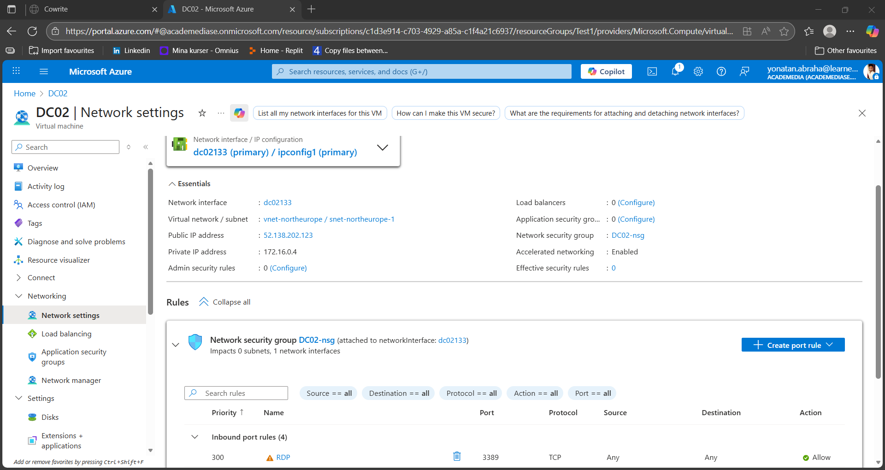

# Azure DC02  
**Windows Server 2022 Datacenter (Azure Edition)**  
**Project Type:** Cloud-Based Domain Controller Setup  

This project demonstrates the deployment and configuration of an **Active Directory Domain Controller** in Microsoft Azure.  
The VM `DC02` hosts **AD DS**, **DNS**, and **DHCP**, forming the cloud-side equivalent of the on-premises domain controller `DC01` in `mylab.local`.  

This environment is part of my ongoing **IT automation and hybrid infrastructure portfolio**, combining **PowerShell**, **Azure networking**, and **Active Directory management**.

---

## Azure Domain Controller (DC02)

This section documents the deployment of an **Azure-based Windows Server 2022 VM** configured as a **Domain Controller**, **DNS**, and **DHCP** server for the domain `azlab.local`.

### 1. VM Deployment
- **Region:** North Europe  
- **Size:** Standard DS2 v2 (2 vCPUs, 7 GiB RAM)  
- **OS:** Windows Server 2022 Datacenter Azure Edition  
- **Public IP:** 52.138.202.123  
- **Private IP:** 172.16.0.4 (static)  
- **VNet:** vnet-northeurope (172.16.0.0/24)  
- **Subnet:** snet-northeurope-1  

### 2. Network Configuration
- **Inbound rule:** RDP (TCP 3389) enabled  
- **DNS Server:** initially Azure DNS, later switched to 127.0.0.1  
- **Default Gateway:** 172.16.0.1  

### 3. Role Installation
Installed server roles and features:  
- Active Directory Domain Services (AD DS)  
- DNS Server  
- DHCP Server  

### 4. Domain and DHCP Configuration
- **New forest:** azlab.local  
- **NetBIOS name:** AZLAB  
- **Domain Controller:** DC02.azlab.local  
- **DHCP authorized in AD**  

  

### 5. DNS Configuration
The DNS zone `azlab.local` was automatically created during AD DS promotion.  
Static A-records confirm name resolution for `dc02.azlab.local`.

---

**Result:**  
`DC02` now operates as a fully functional **Domain Controller**, **DNS**, and **DHCP** server hosted in Azure.  
This serves as the **cloud counterpart** to the on-prem `dc01.mylab.local` and lays the groundwork for **future hybrid AD integration**.

---

## 🔗 Related Projects
- [On-premise DC01 (mylab.local)](https://github.com/YOURUSERNAME/OnPrem-DC01)  
*(Replace with your actual repo link)*

---

## 🧠 Skills Demonstrated
- Azure Virtual Network and subnet configuration  
- Static IP assignment and NSG management  
- PowerShell-based AD DS, DNS, and DHCP deployment  
- Active Directory forest creation and DHCP authorization  
- Cloud infrastructure documentation and architecture design

---

## 📸 Screenshots
All screenshots are stored in the repository for reference:  
`azure overview1.png`, `2network.png`, `server manager dc02.png`, `5 get addomain.png`, `get dhcpserverindc.png`, `DNS manager.png`

---

*Created and maintained by Yonatan Abraha — IT Technician & Azure Administrator in training.*
# Azure-DC02
Deployment of a Windows Server 2022 Domain Controller, DNS, and DHCP in Azure (azlab.local) – part of my hybrid Active Directory lab project.
